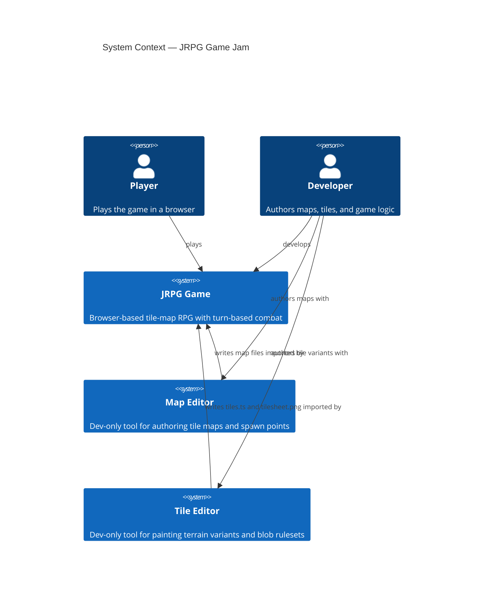
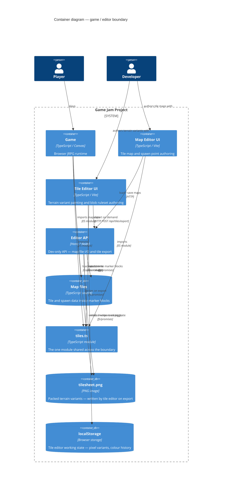
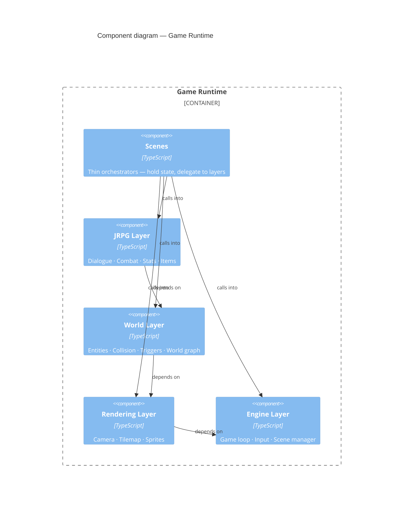
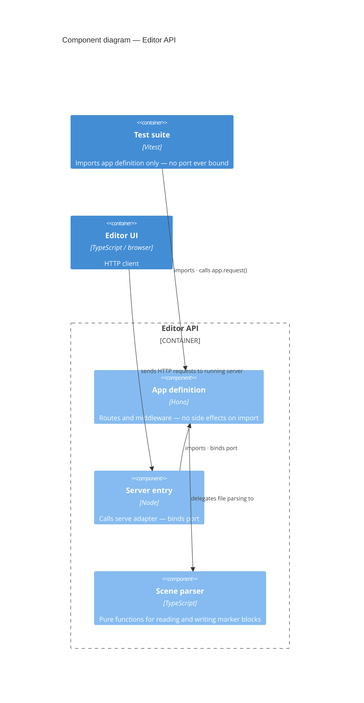

# Architecture

> Read this first. The diagrams below follow the C4 model — each level drills one layer deeper into the system. Full rationale for every decision lives in `documents/decisions/`.

---

## Level 1 — System Context

Who uses the system and what the two top-level systems are.

---

## Level 2 — Containers

The containers inside the project boundary. Authoritative crossing points between game and editor tools are exactly: `src/world/tiles.ts` (shared module) and the map files (marker blocks). Everything else stays on one side of the boundary.

→ Shared module boundary: [ADR 0004](documents/decisions/0004-single-shared-module-boundary.md)
→ Working state isolation: [ADR 0007](documents/decisions/0007-tile-editor-localstorage-working-state.md)

---

## Level 3 — Game Runtime Components

The five components inside the game runtime. Arrows show dependency direction. Any arrow pointing downward in this diagram is a violation of the layering rule.

→ Rationale: [ADR 0005 — Four-layer architecture with strict dependency direction](documents/decisions/0005-four-layer-architecture.md)

---

## Level 3 — Editor API Components

The components inside the editor API. The key structural fact: tests import the app definition directly and never touch the server entry, so no port is ever bound during a test run.

→ Rationale: [ADR 0006 — Hono for the editor API; app-definition separate from server entry](documents/decisions/0006-hono-editor-api-testability.md)

---

## Design decisions index

| ADR | Decision |
|-----|----------|
| [0001](documents/decisions/0001-custom-game-loop-no-engine.md) | Custom game loop — no engine dependencies |
| [0002](documents/decisions/0002-fixed-canvas-resolution.md) | Fixed internal canvas resolution |
| [0003](documents/decisions/0003-editor-game-contract-marker-blocks.md) | Editor/game contract via marker blocks |
| [0004](documents/decisions/0004-single-shared-module-boundary.md) | Single shared module boundary (`tiles.ts`) |
| [0005](documents/decisions/0005-four-layer-architecture.md) | Four-layer architecture, strict dependency direction |
| [0006](documents/decisions/0006-hono-editor-api-testability.md) | Hono for editor API; app definition separate from server entry |
| [0007](documents/decisions/0007-tile-editor-localstorage-working-state.md) | Tile editor: localStorage as working state, repo as published state |
| [0008](documents/decisions/0008-lch-colour-space-no-library.md) | LCH colour space for palette authoring; hand-rolled conversion |
| [0009](documents/decisions/0009-blob-tile-same-type-matching.md) | Blob tile ruleset: same-type matching; transitions via dedicated terrain types |
