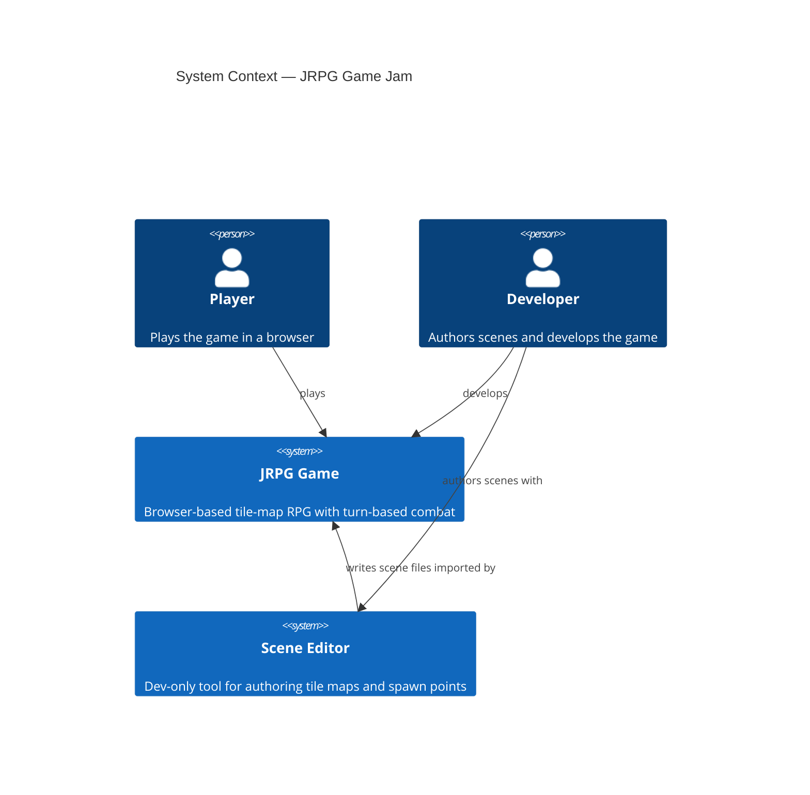
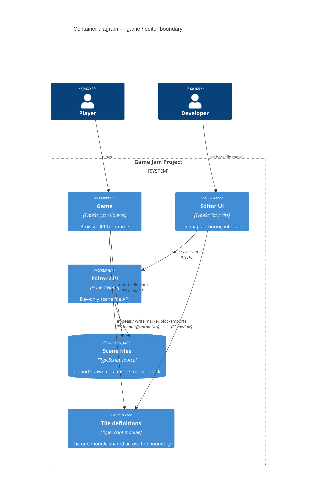
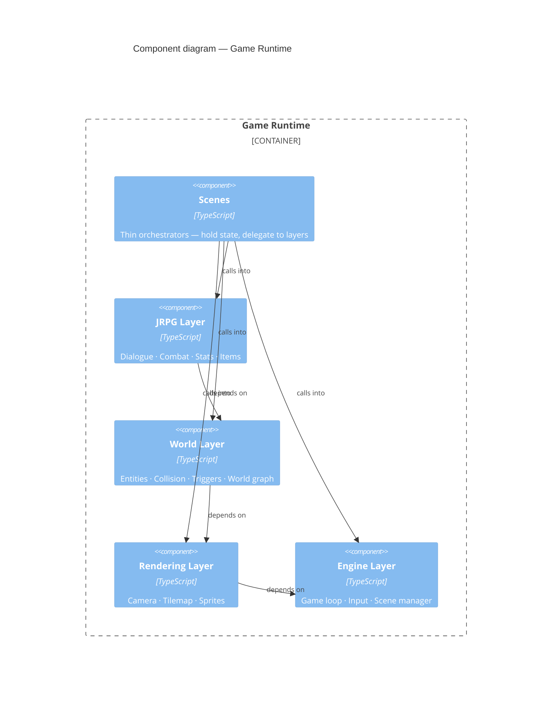
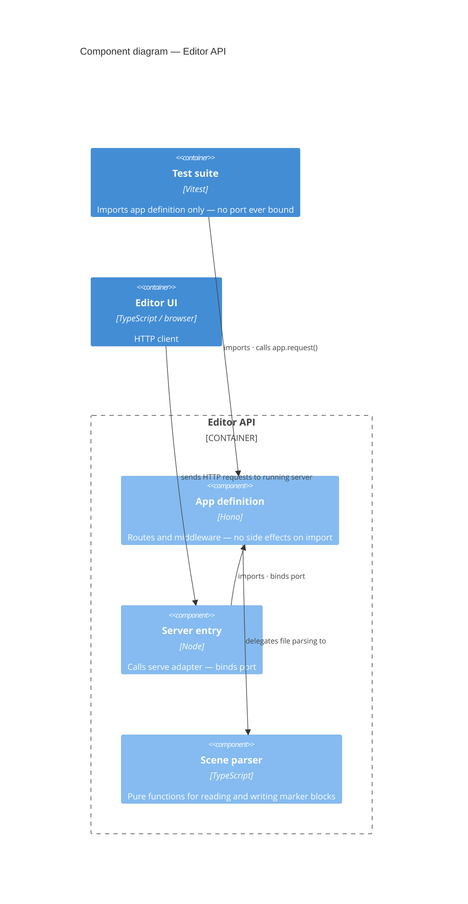

# Architecture

> Read this first. The diagrams below follow the C4 model — each level drills one layer deeper into the system. Full rationale for every decision lives in `documents/decisions/`.

---

## Level 1 — System Context

Who uses the system and what the two top-level systems are.

---

## Level 2 — Containers

The containers inside the project boundary and every relationship crossing the game/editor line. There are exactly two crossing points. A third crossing is a design violation.

→ Rationale: [ADR 0004 — Single shared module between editor and game](documents/decisions/0004-single-shared-module-boundary.md)

---

## Level 3 — Game Runtime Components

The five components inside the game runtime. Arrows show dependency direction. Any arrow pointing downward in this diagram is a violation of the layering rule.

→ Rationale: [ADR 0005 — Four-layer architecture with strict dependency direction](documents/decisions/0005-four-layer-architecture.md)

---

## Level 3 — Editor API Components

The components inside the editor API. The key structural fact: tests import the app definition directly and never touch the server entry, so no port is ever bound during a test run.

→ Rationale: [ADR 0006 — Hono for the editor API; app-definition separate from server entry](documents/decisions/0006-hono-editor-api-testability.md)
