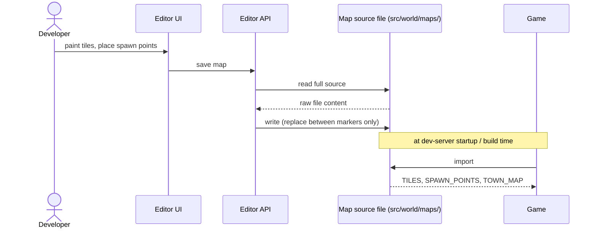

# ADR 0003 — Editor/game contract via marker blocks in source files

**Status:** Accepted

## Context

The map editor needs to write tile and spawn data in a form the game can read. Several approaches exist:

**Separate data files (JSON/YAML):** The editor writes a data file; the game imports it. Requires a loader or import assertion. Two files per map instead of one.

**Build step / code generation:** The editor writes JSON; a build script generates TypeScript. Requires the build step to run before the game compiles. Adds tooling complexity and a sync failure mode.

**Direct source file mutation with markers:** The map file is a TypeScript module with comment markers delimiting the editor-managed section. The editor reads the file, replaces only the content between the markers, and writes it back. The game imports the same file — no sync step, no separate format, no build step.

## Decision

Use marker blocks in TypeScript source files. Two comment markers define the boundary. The editor owns everything between them. Everything outside the markers is untouched — the `Tilemap` definition and any imports live outside the markers and are not touched by the editor.

Map files live in `src/world/maps/`. The markers delimit the `TILES` array and `SPAWN_POINTS` record. The `Tilemap` definition (spritesheet coordinates, solid flags) lives below the markers and is hand-authored.

The game and the editor never communicate directly. The map file is the only shared artefact, and each side accesses it differently: the editor API mutates it through the filesystem, the game imports it as a module.

## Consequences

The game always reads the latest editor output. There is no sync step, no intermediate format, and no additional tooling.

The cost is a format contract. The content between the markers is a serialized string that the editor's serializer produces and the editor's parser consumes. If they drift, the file becomes unreadable by the editor — though the game can still import it, so the failure is silent until the next time someone opens the editor. The parser and serializer tests are the only thing preventing this. They are not optional, and a failing test in that suite means the contract has broken.

The other cost is that the format is invisible to a new reader of a scene file. The markers look like comments. This ADR is the explanation for why they are there and why they must not be removed.

---

*See also: [ADR 0004](0004-single-shared-module-boundary.md) — the boundary this contract serves, and why the scene file is one of exactly two crossing points between the game and the editor.*
