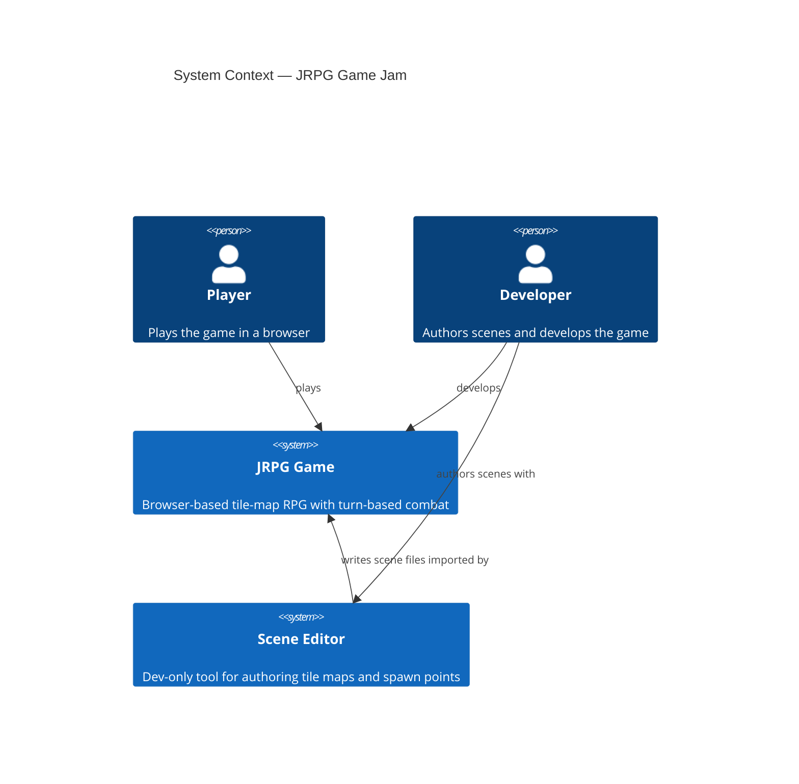
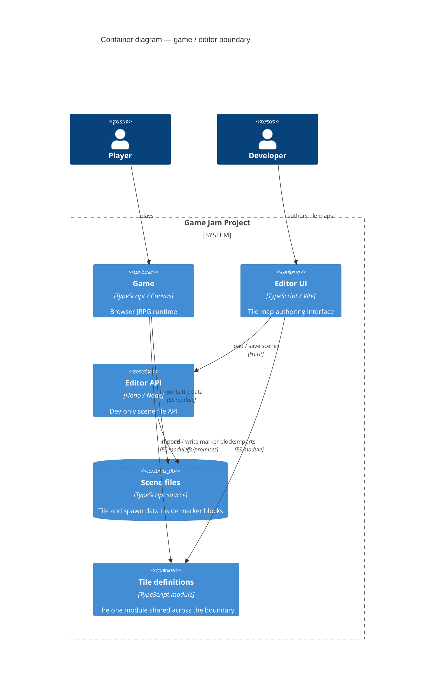

# ADR 0004 — Single shared module between editor and game

**Status:** Accepted

## Context

The scene editor renders a tile palette. The game renders a tile map. Both need to know what tiles exist and what they look like. This creates an import dependency question: how much of the game codebase should the editor be allowed to import?

Three positions:

**No sharing:** Duplicate tile definitions in both the game and the editor. They drift over time. Adding a tile means editing two files.

**Share freely:** The editor imports from game modules as needed. The boundary between "game code" and "editor code" dissolves. The game build picks up editor dependencies. Testing becomes harder because the editor and game are coupled.

**Exactly one shared module:** One module crosses the boundary. Both the game and the editor import it. Everything else is owned exclusively by one side.

## Decision

Exactly one module crosses the game/editor boundary: the tile definitions. This module defines what tiles exist, their display properties, and whether they block movement. It is a pure data module with no runtime behaviour.

The editor does not import from game scenes, world maps, the JRPG layer, or anything else in the game. The game does not import from the editor. If a new piece of shared data is needed, the question is not "should I import it?" but "does it belong in the one shared module, or have I found a design problem?"

Drilling in to the container level:

The diagram shows exactly two lines crossing the game/editor boundary: the scene files (accessed differently by each side — the game imports them, the editor API reads and writes them via the filesystem) and the tile definitions module (imported directly by both). Any future change that adds a third crossing is a design violation.

## Consequences

The editor is genuine dev tooling that happens to share one data file with the game. The game build contains no editor code. The shared module can be tested in isolation.

The tradeoff: tile properties that are only relevant to the editor (display colour, human-readable name for the palette) live in the shared module, which is nominally a game module. This is a mild violation — the game imports a property it doesn't use. It is acceptable because the alternative (a separate editor-only tile metadata file that must be kept in sync) creates the drift problem this decision was designed to avoid.

If the shared module starts to accumulate editor-only concerns at scale, the right move is to split it into a pure-data core (shared) and an editor-metadata extension (editor-only), with the editor importing both.

---

*See also: [ADR 0003](0003-editor-game-contract-marker-blocks.md) — the marker-block protocol, which is the mechanism by which the scene file crossing point works.*
