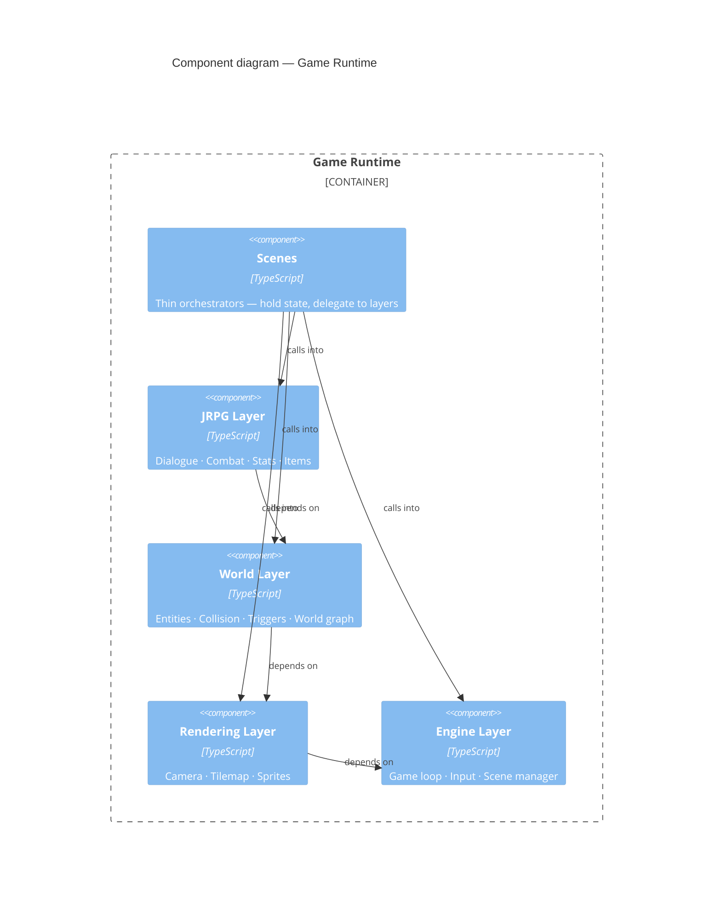

# ADR 0005 — Four-layer architecture with strict dependency direction

**Status:** Accepted

## Context

A JRPG has several distinct concerns: the engine loop itself, rendering, spatial world simulation, and JRPG-specific game rules. These could be organized in several ways:

**Flat / feature-organized:** All combat code in one place, all map code in one place. No layers — things depend on whatever they need. Common in jam projects, readable early, entangled quickly.

**Object-oriented inheritance:** Game objects inherit from a base class and carry their own render logic. The Unity/Godot model. Makes sense when you have an engine managing object lifecycle, not when you are writing the engine.

**Layered with enforced direction:** Separate layers defined by abstraction level. Higher layers may depend on lower layers; lower layers may never depend on higher ones. Each layer has a clear mandate.

## Decision

Four layers, with dependency flowing strictly downward:

Each layer's mandate in one sentence:
- **Engine** — drives time and input. Knows nothing about tiles, combat, or dialogue.
- **Rendering** — takes data in, calls canvas methods out. Does not read game state.
- **World** — reasons spatially. Does not know about JRPG mechanics.
- **JRPG** — reasons about game rules. Does not know about the canvas.

Scenes sit above all four layers as thin orchestrators: they hold references to game state and delegate to the layers, but do not implement logic themselves.

## Consequences

Each layer is independently testable. Rendering cannot be unit-tested (the canvas is a browser API); everything else can. The layer boundary is the test boundary: any function that is pure data-in/data-out gets a test. Any function that calls canvas methods does not.

The dependency direction is also the coupling direction. A rendering function that reads JRPG state is a violation — it means rendering is now coupled to the JRPG layer and changes to one break the other. The rule for scenes enforces this: a method that calls canvas APIs belongs in rendering; a method that is pure of canvas and reads no scene state belongs in world or JRPG.

The cost is discipline. Nothing in the language prevents a world function from importing JRPG types. The enforcer is code review and the principle: if you are about to import upward, the design is wrong.

Key observations about how the layers interact in practice:

- **The Scene Manager is the linchpin.** It is the one component that touches all layers — it runs whichever scene is active and mediates transitions between them. Build it carefully; it is the host for everything else.
- **Audio is a lateral service.** It has no dependency on rendering, world, or JRPG logic. Scene lifecycle hooks (`onEnter`/`onExit`) call the audio manager; game events call it for sound effects. Removing audio leaves the rest of the engine unchanged.
- **Item registry is read-only at runtime.** Definitions are authored at startup and never mutated. Inventory state is the mutable counterpart, held on party data.

---

*See also: [ADR 0001](0001-custom-game-loop-no-engine.md) — the custom loop decision that makes this layering possible without a framework imposing its own structure.*
