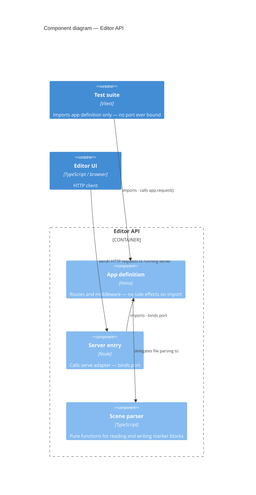

# ADR 0006 — Hono for the editor API; app-definition separate from server entry

**Status:** Accepted

## Context

The scene editor needs a dev-only HTTP API to read and write scene files on the local filesystem. The API is never deployed; it runs only during development. Three options for the server:

**Bare Node.js http module:** No framework, no dependencies. Very verbose routing; requires manual request parsing and response formatting. Tests would need to spin up a real server on a port.

**Express:** Familiar, widely documented, large ecosystem. Uses Node's `IncomingMessage`/`ServerResponse` model. Testing routes requires supertest or a real running server, both of which bind a port.

**Hono:** Minimal framework built on the Fetch API (`Request`/`Response`). Has an `app.request()` method that dispatches directly through the router in-process, returning a `Response` — no port, no HTTP, no setup/teardown. Also happens to be portable across runtimes that support the Fetch API.

The key requirement is that route tests must be fast and must not bind a port.

## Decision

Use Hono. Split the app definition from the server entry: one module exports the Hono instance, a separate module imports it and calls the serve adapter. Tests import only the app module — never the server entry module. This prevents any port from being bound when tests run.

## Consequences

Route tests call `app.request()` directly. They are synchronous with the Hono router, require no test server lifecycle, and run as fast as any other unit test. There is no port to conflict with, no teardown to forget, no race condition on startup.

The structural consequence is one extra module at the server entry point. That is the entire cost.

If the editor API ever needs to run outside Node.js — unlikely, but possible — Hono's Fetch-API foundation makes that straightforward. Express could not offer that without a rewrite.

---

*See also: [ADR 0003](0003-editor-game-contract-marker-blocks.md) — the marker-block contract this API implements.*
