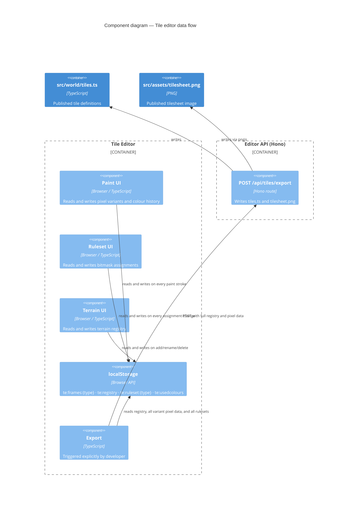

# ADR 0007 — Tile editor: localStorage as working state, repo files as published state

**Status:** Accepted

## Context

The tile editor authors pixel art variants and blob ruleset assignments for each terrain type. That work needs to survive page refreshes and be safe to iterate on — a developer should be able to paint half a grass variant, close the tab, reopen it, and continue without losing work.

Two places could hold this mutable authoring state:

**Repo files directly (`src/world/tiles.ts` and `src/assets/tilesheet.png`):** Every paint stroke writes to disk via the Hono API. Immediate persistence, but every mid-session call produces a half-finished file that the game and map editor will pick up. A developer who paints one pixel of a grass variant and reloads the game now has a broken grass tile in the game renderer.

**localStorage:** The browser holds working state. Repo files are only updated when the developer explicitly presses Export. The game and map editor always see a complete, coherent set of tile definitions. The tile editor is free to be in any intermediate state without poisoning consumers.

## Decision

The tile editor uses localStorage as its working state. The Hono API is called only on explicit export.

- All pixel variant data is stored in localStorage keyed by terrain type (`te:frames:{type}`).
- The terrain registry (id, display name, solid flag, editor colour) is stored in localStorage (`te:registry`).
- Blob ruleset assignments (bitmask → variant index + flip flags) are stored per terrain type (`te:ruleset:{type}`).
- Working colour history for the active session is stored in localStorage (`te:usedcolours`).
- `src/world/tiles.ts` and `src/assets/tilesheet.png` are only written when the developer triggers an export.
- localStorage is the source of truth for the authoring session. The repo files are the published output.

**localStorage key schema:**

| Key pattern | Written by | Contains |
|---|---|---|
| `te:frames:{type}` | Paint UI | Array of pixel arrays — one per variant |
| `te:registry` | Terrain management UI | Array of `{ id, name, solid, editorColour }` |
| `te:ruleset:{type}` | Ruleset UI | `Record<bitmask, { frameIdx, flipX, flipY }>` |
| `te:usedcolours` | Paint UI | Array of recently used hex colours |

## Consequences

The game and map editor are always reading a complete, coherent `tiles.ts`. No half-finished authoring session ever corrupts a consumer.

The tile editor is resilient to mid-session interruption. Work survives page refreshes and browser restarts. Clearing localStorage loses unsaved work — developers are responsible for exporting before clearing browser storage. This is acceptable for a dev tool.

The tradeoff: localStorage is not version-controlled. If a developer clears their browser storage before exporting, their unpublished work is gone. The mitigations are the explicit Export button (makes the save action conscious) and the fact that all published state is in the repo and can be re-loaded as a starting point.

---

*See also: [ADR 0004](0004-single-shared-module-boundary.md) — `src/world/tiles.ts` as the single shared module that Export writes to.*
