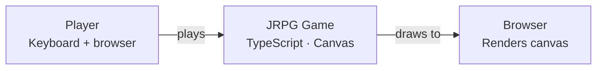
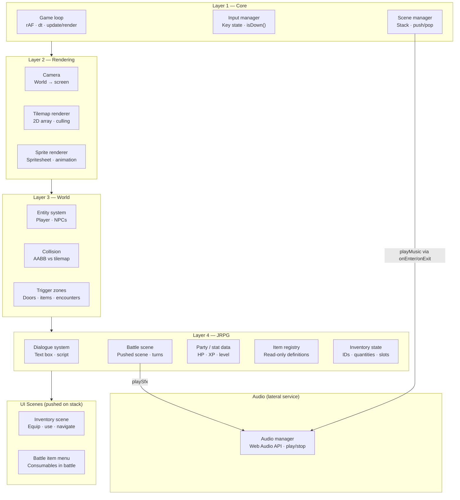

# JRPG Engine Spec
> TypeScript · HTML5 Canvas · Custom game loop · No engine dependencies

---

## Project Goal

A simple JRPG running in the browser. Overworld exploration, NPC dialogue, random encounters, turn-based combat. Audience: one kid, zero tutorials. Playable before fancy.

---

## Architecture Overview

```
LAYER 1 — Core Engine
├── Game loop
├── Input manager
└── Scene manager

LAYER 2 — Rendering
├── Camera
├── Tilemap renderer
└── Sprite renderer

LAYER 3 — World
├── Entity system
├── Collision (AABB vs tilemap)
└── Trigger zones

LAYER 4 — JRPG Layer
├── Dialogue system
├── Battle scene
├── Party / stat data
├── Item registry
└── Inventory system

LAYER 4 (UI scenes, pushed on stack)
├── Inventory scene
└── Battle item submenu
```

Higher layers depend on lower layers. Never the reverse.

---

## Build Order & Milestones

Each milestone ends with something **visibly playable**. Ship the milestone before starting the next one.

---

### Milestone 1 — Core Engine
**Done when:** A character rectangle moves around a blank canvas.

#### 1.1 Game Loop
- [x] `requestAnimationFrame` loop
- [x] Delta time (`dt`) in seconds, capped at 50ms
- [x] Separate `update(state, dt)` and `render(ctx, state)` functions
- [x] Pure `update` — no side effects, fully unit-testable

#### 1.2 Input Manager
- [x] Track key state as a `Set<string>` (held keys, not events)
- [x] `isDown(key: string): boolean` helper
- [x] Bind: Arrow keys + WASD for movement, Z/Enter for confirm, X/Escape for cancel

#### 1.3 Scene Manager
- [x] Scene interface: `{ update(dt): void; render(ctx): void; onEnter?(): void; onExit?(): void }`
- [x] Scene stack: `push(scene)`, `pop()`, `replace(scene)`
- [x] Active scene is always `stack[top]`
- [x] Pushing battle scene over overworld scene (not replacing it)

---

### Milestone 2 — Rendering
**Done when:** The character walks around a tile-based map.

#### 2.1 Tilemap Renderer
- [x] Tile data as a 2D number array
- [x] Tile size constant (e.g. 16px or 32px)
- [x] Render only tiles within camera viewport (culling)
- [x] Solid vs. walkable tile flag per tile type

#### 2.2 Camera
- [x] Camera as `{ x, y }` in world space (px)
- [x] World-to-screen transform: `screenX = worldX - camera.x`
- [x] Camera follows player, clamped to map bounds
- [x] All rendering goes through camera offset

#### 2.3 Sprite Renderer
- [x] Load spritesheet from `` element
- [x] `drawSprite(ctx, sheet, frameX, frameY, destX, destY)`
- [x] Animation: frame index advances on a timer (not every update)
- [x] Walk cycle: idle, walk-left, walk-right, walk-up, walk-down

---

### Milestone 3 — World
**Done when:** The player can't walk through walls, and stepping on a tile can fire an event.

#### 3.1 Entity System
- [x] Entity interface: `{ x, y, width, height, sprite?, update?(dt): void }`
- [x] Player is an entity
- [x] NPCs are entities (static for now)
- [x] Entity list owned by the active scene

#### 3.2 Collision — AABB vs Tilemap
- [x] Resolve player movement against solid tiles
- [x] Separate X and Y axis resolution (prevents corner-catching)
- [x] Helper: `getTileAt(worldX, worldY): Tile`
- [x] No entity-vs-entity collision needed for MVP

#### 3.3 Trigger Zones
- [x] Trigger: `{ x, y, width, height, onEnter(): void }`
- [x] Check player AABB against all triggers each frame
- [x] Use cases: doors (scene transition), NPC talk radius, encounter zones

---

### Milestone 4 — JRPG Layer
**Done when:** The player can talk to an NPC, enter a battle, and win or lose.

#### 4.1 Dialogue System
- [x] Dialogue box rendered over the scene (not a new scene)
- [x] Text advances on Z/Enter
- [x] Script: array of strings, stepped through in order
- [x] Input blocked for overworld while dialogue is open
- [x] Optional: speaker name label

#### 4.2 Battle Scene
- [x] Pushed onto scene stack (overworld pauses underneath)
- [x] State machine: `player-turn → enemy-turn → resolve → next-turn`
- [x] Actions: Attack, Item (one item type), Run
- [x] Enemy has HP, attack, and a dead state
- [x] Victory: pop battle scene, resume overworld
- [x] Defeat: game over screen (simplest possible — "Game Over" + restart)

#### 4.3 Party & Stat Data
- [x] Player stats: `{ hp, maxHp, attack, defense, level, xp }`
- [x] XP gain on victory, level-up threshold
- [x] One enemy type to start; add more after combat loop feels good
- [x] Wire healing item from inventory into battle Item action

---

### Milestone 5 — Inventory System ✅ Done
**Done when:** The player can open an inventory menu, equip gear, and use a consumable in battle.

#### 5.1 Item Registry
- [x] Item definition: `{ id, name, type: 'equipment' | 'consumable', effect }`
- [x] Equipment definition extends with: `{ slot: 'weapon' | 'armour' | 'accessory', statDeltas }`
- [x] Consumable definition extends with: `{ effect: (partyState) => partyState }`
- [x] Global read-only item registry — definitions never change at runtime
- [x] No durability

#### 5.2 Inventory State
- [x] Inventory held on party data: map of item ID to quantity
- [x] Equipment slots on party data: `{ weapon, armour, accessory }` — each holds an item ID or empty
- [x] `addItem(inventory, itemId)` — increments quantity
- [x] `removeItem(inventory, itemId)` — decrements quantity, errors if none held
- [x] Derived stats always computed from base stats plus equipped gear — never cached

#### 5.3 World Item Pickups
- [x] Chest trigger fires on approach (inside the small building)
- [x] Trigger calls `addItem`, marks chest collected (one-shot), shows "Found a Potion!" dialogue
- [x] Battle uses potion count from inventory; consumed potions deducted on exit

---

### Milestone 6 — Inventory UI
**Done when:** The player can navigate the inventory menu with the keyboard and equip or use items.

#### 6.1 Inventory Scene
- [ ] Pushed onto scene stack from overworld (X/Escape pops it)
- [ ] Keyboard cursor navigation between items
- [ ] Two tabs: Equipment and Consumables
- [ ] Equip action: swaps item into correct slot, returns displaced item to inventory
- [ ] Stat preview: shows effective stats with item equipped before confirming

#### 6.2 Battle Item Submenu
- [ ] Shown when player chooses Item action in battle
- [ ] Lists consumables only — no equipment changes mid-battle
- [ ] Selecting a consumable applies its effect function to party state and ends player turn

---

### Milestone 7 — Audio (time permitting)
**Done when:** Music loops on the overworld and a sound plays on a combat hit.

Do not start this milestone until Milestone 6 is complete and the game is fully playable. Audio is the easiest system to add last and the easiest to lose a day to early — Web Audio API has real gotchas (autoplay policy, context suspension) that will pull you off the critical path.

#### 7.1 Audio Manager
- [ ] Single `AudioContext` created on first user interaction (browser autoplay policy)
- [ ] `playMusic(track)` — loads and loops a background track, stops any current track
- [ ] `playSfx(sound)` — fires a one-shot sound effect
- [ ] Volume control for music and SFX independently

#### 7.2 Hookup
- [ ] Overworld scene plays looping background music on `onEnter`, stops on `onExit`
- [ ] Battle scene plays its own music track
- [ ] Combat hit plays a sound effect
- [ ] Dialogue confirm plays a sound effect

---

## C4 Architecture

### Level 1 — System Context



_L2 is trivial — one browser, one canvas, one `<script type="module">`. Skipped._

---

### Level 3 — Components

Arrows point **downward only**. No lower layer imports from a higher one. Audio is a lateral service — it is called by scenes via lifecycle hooks, not by the engine layers directly.



**The Scene Manager is the linchpin** — it is the host that runs whichever layer's scene is currently active. It is the one component that touches all layers. Build it carefully.

**Audio is a lateral service** — it has no dependency on rendering, world, or JRPG logic. Scene lifecycle hooks (`onEnter`/`onExit`) call `playMusic`; game events call `playSfx`. Removing audio leaves the rest of the engine unchanged.

**Item registry is read-only at runtime** — definitions are authored at startup and never mutated. Inventory state is the mutable counterpart, held on party data.

---

## Scene Authoring

A scene is three things held together as plain data: a tilemap, an entity list, and a trigger list. The engine consumes them; the scene does not contain logic.

### Tilemap

A tilemap is a 2D array of tile IDs paired with a lookup table that maps each ID to its visual and physical properties — which cell on the spritesheet to draw, and whether the tile is solid or walkable. The 2D array is the map layout; the lookup table is the tile vocabulary.

**Authoring approach:** Hardcode scenes as TypeScript data files for this jam. A factory function (e.g. `buildTownScene()`) that returns the scene record is sufficient. Reach for a map editor only if editing tile arrays by hand becomes painful — at that point, Tiled exports JSON that maps directly onto this structure.

### Spritesheet

A single image containing all tile frames and character frames, divided into a uniform grid. A tile ID maps to a grid position (column, row) on the sheet. This keeps asset files small and draw calls simple.

Tile IDs and sprite grid positions are the only coupling between the tilemap data and the spritesheet image. Changing the spritesheet layout means updating the lookup table, not the map data.

### Entities

An array of entity records owned by the scene — player, NPCs, anything with a position and a sprite. Entities are data; behaviour (e.g. a wandering NPC) is an optional update function attached to the record. The entity list is passed to the update and render functions each frame.

### Triggers

An array of rectangular zones in world space, each with a callback. The engine checks player overlap against all triggers every frame. A door, an encounter zone, and an NPC talk radius are all the same structure with different callbacks.

### Scene as a record

Scenes are plain data records, not classes. A scene object contains its tilemap, entity list, and trigger list. The Scene Manager holds the active scene; the engine's update and render functions consume it. Logic lives in the engine, not in the scene.

---

## TDD Approach

### Tooling decisions

- **Test runner:** Vitest
- **Project scaffold:** Vite with the vanilla-ts template
- **Test environment:** `node` — pure logic tests have no DOM dependencies, so jsdom is unnecessary overhead. Add jsdom only if a future module genuinely needs DOM type availability.

---

### What to test and what not to

The game loop boundary determines what is testable. `requestAnimationFrame` and the canvas rendering context are browser APIs that do not exist in the test environment. The rAF shell and all `render()` functions are left untested by design. Everything else should be covered.

The rule: **if a function takes data in and returns data out with no browser API dependencies, it gets a test.**

| Component | Testable | Reason |
|---|---|---|
| rAF shell | No | Browser API |
| `render()` functions | No | Canvas side effects |
| `update(state, dt)` | Yes | Pure function |
| Input manager | Yes | Pure key state |
| Scene manager | Yes | Pure stack operations |
| Collision math | Yes | Pure function |
| Trigger detection | Yes | Pure function |
| Dialogue state | Yes | Pure state machine |
| Battle state machine | Yes | Pure state machine |
| Party / stat data | Yes | Pure data + logic |
| Item registry | Yes | Pure data |
| Inventory state | Yes | Pure data + logic |
| Derived stat calculation | Yes | Pure function |
| Audio manager | No | Web Audio API |

---

### Module structure

Source is organised by layer, mirroring the C4 component diagram. Each module owns its logic and its test file lives alongside it. The rAF shell (`main.ts`) sits at the root and is the only file with no corresponding test.

Layers: `engine/`, `rendering/`, `world/`, `jrpg/`, `audio/`

---

### TDD rhythm

1. Write a failing test that describes the behaviour in plain English
2. Write the minimum code to make it pass — no more
3. Refactor if needed, keeping tests green
4. Move on

---

### Implementation decisions

Decisions made during build that aren't obvious from the spec.

| Decision | What we chose | Why |
|---|---|---|
| Input key identity | `e.code` (e.g. `"KeyW"`, `"ArrowUp"`) not `e.key` (e.g. `"w"`) | Physical key position — WASD works on any keyboard layout |
| Engine state mutations | All state functions return new objects; never mutate in place | Makes state transitions debuggable; log every call and see exactly what changed |
| Scene lifecycle side effects | `push` calls `onEnter`; `pop` calls `onExit` on the departing scene only (does NOT call `onEnter` on the newly-active scene); `replace` calls `onExit` then `onEnter` | `pop` is a resume, not a fresh entry — the scene underneath is already alive. `onEnter` is only guaranteed on initial push or replace. |
| Scene-lifetime init | State that must survive the full lifetime of a scene (e.g. camera target) belongs in the constructor, not `onEnter` | `onEnter` is called on initial push and `replace` but NOT when the scene resumes after a pushed scene pops. Putting live state there causes it to be missing on resume. |
| Fixed render resolution | `canvas.width = 640; canvas.height = 360` in `main.ts`, fixed forever. CSS scales it to fill the window. `image-rendering: pixelated` keeps it sharp. | If the canvas matches the browser window (e.g. 1440×900), the entire 960×640 map fits — `clampCamera` returns `{0,0}` and nothing ever scrolls. Fixed internal resolution is required for any camera movement to be visible. |
| Scene transition handle | `SceneManager` interface passed to scene constructors (`push`, `pop`, `replace`) | Scenes need to drive their own transitions (e.g. BattleScene pops itself); threading a handle is cleaner than a global |
| Battle input guard | Unified `actionConsumed` flag, reset only when all action keys are released | `isActionDown` is held-not-pressed — without a guard, holding Z spams actions every frame; `setTimeout` also caused over-pop (scheduling multiple pops while key was held); replaced with in-loop `exitTimer` |
| Stats persistence | `PlayerStats` owned by `OverworldScene`, passed to `BattleScene` at construction, returned via exit callback | Avoids global mutable state; OverworldScene applies `applyXp` on victory and merges updated HP on any outcome |
| Overworld movement model | Tile-aligned: `{ tileX, tileY, offsetX, offsetY, moving }` — logical position in tiles, visual offset animates from `±TILE_SIZE` to `0` | Free pixel movement drifts off-grid; tile-aligned movement is authentic JRPG feel and makes collision trivial |
| Overworld collision strategy | Pre-move tile check (`isSolid(map, nextTileX, nextTileY)`) before committing a step, not AABB resolution | With tile-aligned movement the destination is always one tile away — checking that single tile is sufficient. `resolveMovement` AABB stays in codebase for any future free-movement scene. |
| Trigger fire timing | Triggers check only on tile arrival (`justArrived = wasMoving && !moving`), not every frame | Fires once per step cleanly; avoids re-firing mid-slide and makes encounter/door logic predictable |
| Item definitions | Read-only registry authored at startup, never mutated at runtime | Separates authoring from state; inventory holds IDs and quantities, not copies of definitions |
| Equipment stat model | Derived stats always computed from base stats plus equipped item deltas — never cached | No cache invalidation needed; recompute is cheap for a small stat set |
| No durability | Item instances have no durability field | Out of scope for this jam; omitting it keeps inventory state simple |
| Camera controller | `CameraController` object owns both position and target logic; held by the scene | Separates camera behavior from scene logic. `target` is a `() => {x,y}` getter — swap it to follow any entity or fixed point. `lerpSpeed` (`null` = snap, `number` px/s = linear glide) handles both instant hard cuts and smooth cinematic pans without extra modes. |

---

### What makes a good game test

- Test behaviour, not implementation. "Player stops at a solid tile" not "resolveX was called."
- Use plain numbers for positions and velocities — no mocks needed if functions are pure.
- Name tests as sentences describing the expected behaviour.
- Keep fixtures small — a 3×3 tile map is enough to test collision.
- One assertion per test where possible. Game logic bugs are easier to find when each test has a single point of failure.

---

## Technical Constraints

| Concern | Decision |
|---|---|
| Language | TypeScript |
| Renderer | HTML5 Canvas 2D |
| Runtime | Browser — modern evergreen |
| Bundler | Vite |
| Engine deps | None |
| Test runner | Vitest |
| Target framerate | 60fps; physics in px/s and px/s² |

---

## Key Constants

These are tuning values, not requirements. Start with reasonable defaults and adjust until the feel is right. Documented here so changes are deliberate, not accidental.

- **Tile size:** 32px — large enough to be legible, small enough to fit a useful map on screen
- **Player speed:** ~160px/s on the overworld — tune until traversal feels brisk but not frantic
- **Delta time cap:** 50ms maximum — prevents physics explosion if the tab loses focus and resumes
- **Gravity:** only relevant if platformer sections are added; not in current scope

---

## Out of Scope (for this jam)

These are good ideas. They are not in this game.

- Save / load
- Multiple party members
- Animated battle sprites
- Map editor
- More than one dungeon
- Item durability
- Quest system — requires story design before engine design; quests drive everything in a real JRPG (FF5/FF6 scale), which makes them a separate project. Revisit if this grows beyond a jam.

---

## Progress Tracker

| Milestone | Status |
|---|---|
| 1 — Core Engine | ✅ Done |
| 2 — Rendering | ✅ Done |
| 3 — World | ✅ Done |
| 4 — JRPG Layer | ✅ Done |
| 5 — Inventory System | ✅ Done |
| 6 — Inventory UI | 🟡 In progress |
| 7 — Audio | ⬜ Not started |

Update statuses: ⬜ Not started · 🟡 In progress · ✅ Done